# Implementing the Edge extension to send event data to the Edge Network<!-- omit in toc -->

## Table of Contents<!-- omit in toc -->
- [Overview](#overview)
  - [Environment](#environment)
- [Adobe Experience Platform setup](#adobe-experience-platform-setup)
  - [1. Create a schema](#1-create-a-schema)
  - [2. Create a datastream](#2-create-a-datastream)
  - [3. Create a property](#3-create-a-property)
  - [4. Configure a Rule to forward Lifecycle metrics to Edge Network](#4-configure-a-rule-to-forward-lifecycle-metrics-to-edge-network)
  - [5. Publish changes](#5-publish-changes)
- [Client-side implementation](#client-side-implementation)
  - [1. Get a copy of the tutorial app code files](#1-get-a-copy-of-the-tutorial-app-code-files)
  - [2. Install the Edge extensions using CocoaPods (dependency manager)](#2-install-the-edge-extensions-using-cocoapods-dependency-manager)
  - [3. Update tutorial app code to enable Edge features](#3-update-tutorial-app-code-to-enable-edge-features)
  - [4. Run app](#4-run-app)
  - [5. `sendEvent` implementation examples](#5-sendevent-implementation-examples)
- [Validation with Assurance](#validation-with-assurance)
  - [1. Set up the Assurance session](#1-set-up-the-assurance-session)
  - [2. Connect to the app](#2-connect-to-the-app)
  - [3. Inspect events with Assurance](#3-inspect-events-with-assurance)

## Overview
This hands-on tutorial provides end-to-end instructions on how to implement the Edge extension to send event data to the Edge Network from a fresh implementation state.

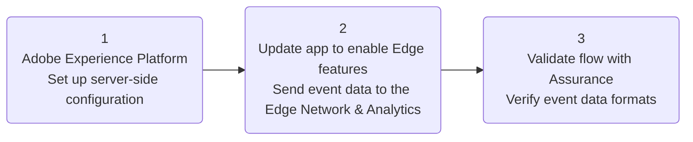

### Environment
- macOS machine with a recent version of Xcode installed
- Cocoapods installed

## Adobe Experience Platform setup
Before any app changes, some configuration items on the Adobe Experience Platform (AEP) side need to be set up. The end goal of this section is to create a mobile property that controls the configuration settings for the various AEP extensions used in this tutorial.

First, create an XDM schema (the format for data that the Edge Network uses) and configure a datastream (controls where the data will go). 

### 1. Create a schema  
At a high level, a schema is a definition for the structure of your data; what properties you are expecting, what format they should be in, and checks for the actual values coming in.  

1. Go to the [Adobe Experience Platform](https://experience.adobe.com/#/platform), using your Adobe ID credentials to log in if prompted.

2. Navigate to the Data Collection UI by selecting the nine-dot menu in the top right (**1**), and selecting `Data Collection` (**2**)  


3. Select **Schemas** in the left navigation window  


4. In the schemas view, select the **+ Create schema** button (**1**) in the top right, then select `XDM ExperienceEvent` (**2**)


Once in the new schema creation view, notice the schema class is `XDM ExperienceEvent` (**1**); schemas adhere to specific class types which just means that they have some predefined properties and behaviors within the Edge platform. In this case, `XDM ExperienceEvent` creates the base properties you see in the `Structure` section that help define some baseline data for each Experience Event. 

5. Give the new schema a name and description (**2**) to help identify it.
6. Select the `+ Add` button (**3**) next to the `Field groups` section under `Composition`.

<details>
  <summary> What is a field group?</summary><p>

A schema is made up of building blocks called field groups.

Think of field groups as blueprints for specific groups of data; the data properties describing things like: the current device in use, products and contents/state of carts, information about the users themselves, etc. 

For example, the `Commerce Details` field group has properties for common commerce-related data like: 
- Product information (SKU, name, quantity)
- Cart state (abandons, product add sources, etc.). 
 
This logical grouping helps organize individual data properties into easily understandable sections. They are even reusable! Once you define a field group, you can use it in any schema that has a compatible class (some field groups only make sense with the capabilities of certain schema classes). There are two types of field groups available:

1. Adobe defined - standardized templates of common use-cases and datasets created and updated by Adobe
    - Note that Adobe Experience Platform services implicitly understand standard field groups and can provide additional functionality on top of just reading and writing data. That's why it is strongly recommended that you use standard field groups wherever possible.
2. Custom defined - any field group outside of the Adobe defined ones that users can use to create their own custom collections of data properties  

See the [Field Groups section in the Basics of schema composition](https://experienceleague.adobe.com/docs/experience-platform/xdm/schema/composition.html?lang=en#field-group) for an in depth look at how field groups work in the context of XDM schemas.

</p></details>

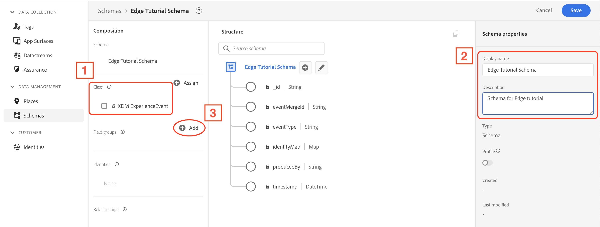

Add the following three Adobe defined field groups to the schema:  
- AEP Mobile Lifecycle Details
- Adobe Experience Edge Autofilled Environment Details
- Commerce Details

Use the search box (**1**) to look up the names (**2**) of the three field groups required for this section. Note the owner of each of the schemas should be **Adobe** (**3**).


<details>
  <summary> Hints for using the <b>Add field groups</b> tool</summary><p>

(<b>1</b>) The Industry filter selections quickly narrow down field groups based on the selected industry. This can be a useful tool to find relevant field groups for your use-case.

(<b>2</b>) The inspector icon lets you see the field group structure, and the info icon presents a card with the field group name, industry, and description.

(<b>3</b>) Popularity: shows how many organizations are using the field group across the Adobe Experience Platform; can potentially be a good place to start in terms of finding which field groups may be the most useful for your needs.

(<b>4</b>) Selected field groups are shown on the right side of the window, where you can quickly see what field groups have been selected so far, and remove individual or all field groups from the current add session.  

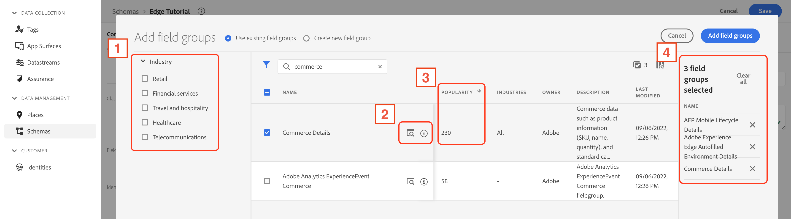  

</p></details>

Verify that all the required field groups are present in the right side info panel (**1**), then select **Add field groups** (**2**). 
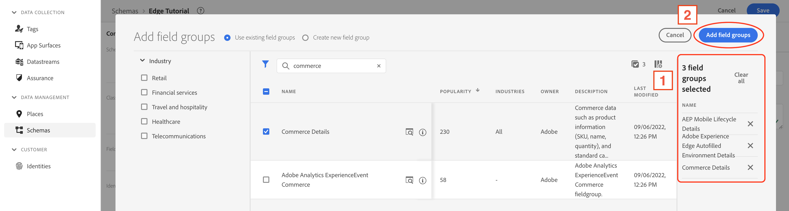  

Verify that the required field groups are present under the **Field groups** section (**1**) and the properties associated with those field groups are present under the **Structure** section (**2**), then select **Save** (**3**).
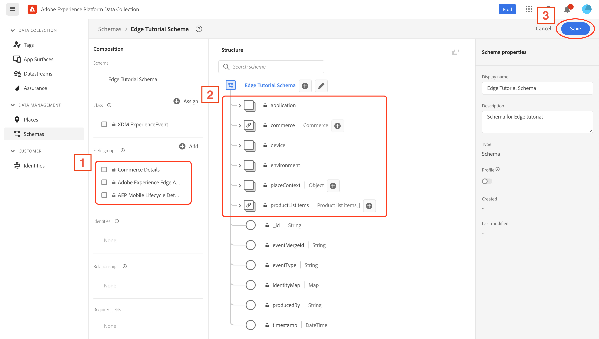  

<details>
  <summary> Hints for using the schema creator tool </summary><p>

To quickly see what properties are from a given field group, select the field group under the **Field groups** section (**1**). The properties are highlighted in the **Structure** section (**2**).

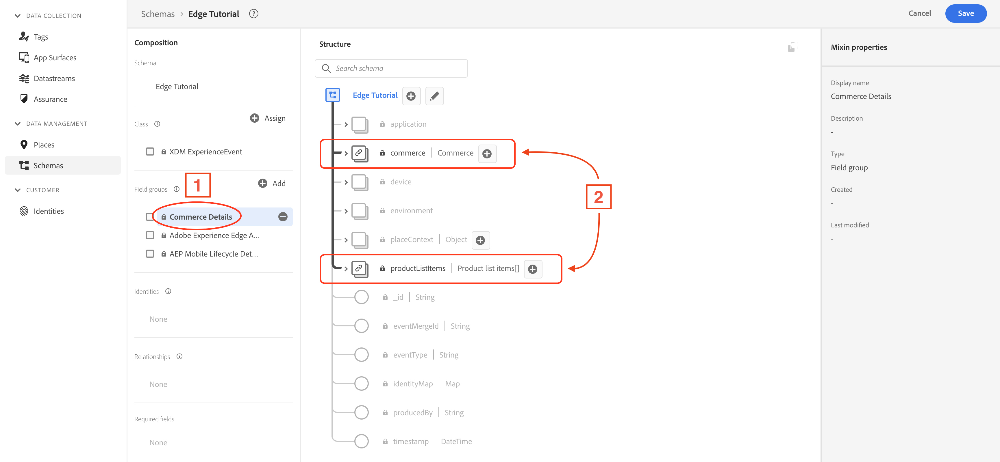  

To see only the properties from a given field group, select the selection box next to the field group (**1**). The properties are filtered to only the selected field group in the **Structure** section (**2**).

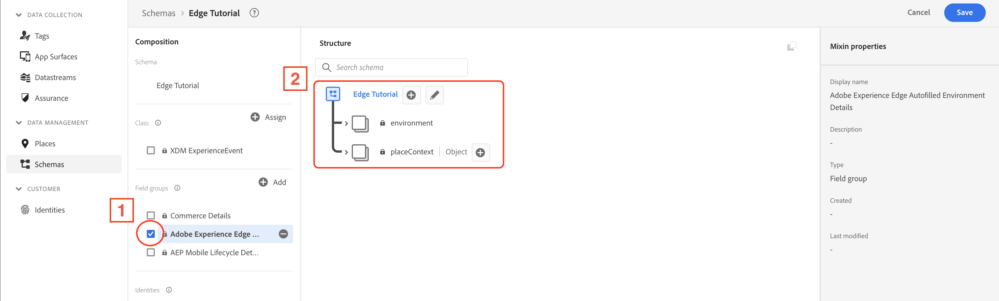  

</p></details>

### 2. Create a datastream

<details>
  <summary> What is a datastream? </summary><p>

A datastream is a server-side configuration on Platform Edge Network that controls where data goes. Datastreams ensure that incoming data is routed to the Adobe Experience Platform application and services (like Analytics) appropriately. For more information, see the [datastreams documentation](https://experienceleague.adobe.com/docs/experience-platform/edge/datastreams/overview.html?lang=en) or this [video](https://experienceleague.adobe.com/docs/platform-learn/data-collection/edge-network/configure-datastreams.html?lang=en).

In order to send data to the Edge Network, the datastream must be configured with the Event schema.

</p></details>

Select **Datastreams** under **DATA COLLECTION** in the left side navigation panel.

  

Select **New Datastream** in the top right.

  

Give the datastream an identifying name and description (**1**), then pick the schema created in the previous section using the dropdown menu (**2**). Then select **Save** (**3**).

  

With the datastream set up, data can be directed to its destination by adding services. In this case, Adobe Analytics:
1. Select **Add Service** (**1**)

  

2. From the **Service (required)** dropdown (**1**), select **Adobe Analytics**.
3. Select **Add Report Suite** (**2**), and enter the report suite ID you want the data from this tutorial to land.
4. Select **Save**.

  

### 3. Create a property

Next, create a property for mobile. A property is basically the configuration settings for AEP extensions, allowing you to control their functionality. 

Select **Tags** (**1**) under **DATA COLLECTION** in the left-side navigation panel.

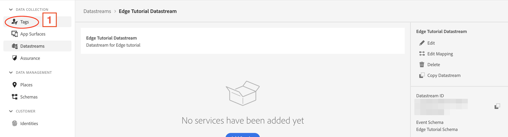  

Select **New Property** (**1**) to create a new property.

  

Enter an identifying name for the new property in the **Name** textfield (**1**), select **Mobile** (**2**) under **Platform**, then select **Save** (**3**).

  

Find and select the mobile property for this tutorial (**2**), optionally using the search box to help quickly narrow down the search (**1**).

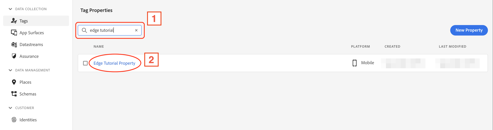  

Select **Extensions** (**2**) in the left-side navigation panel, under **AUTHORING**. Notice there are some extensions are that installed by default (**1**).

  

Select **Catalog** (**1**) and (optionally) use the search box (**2**) to find the required extensions; select the **Install** button in an extension card to install the extension. 

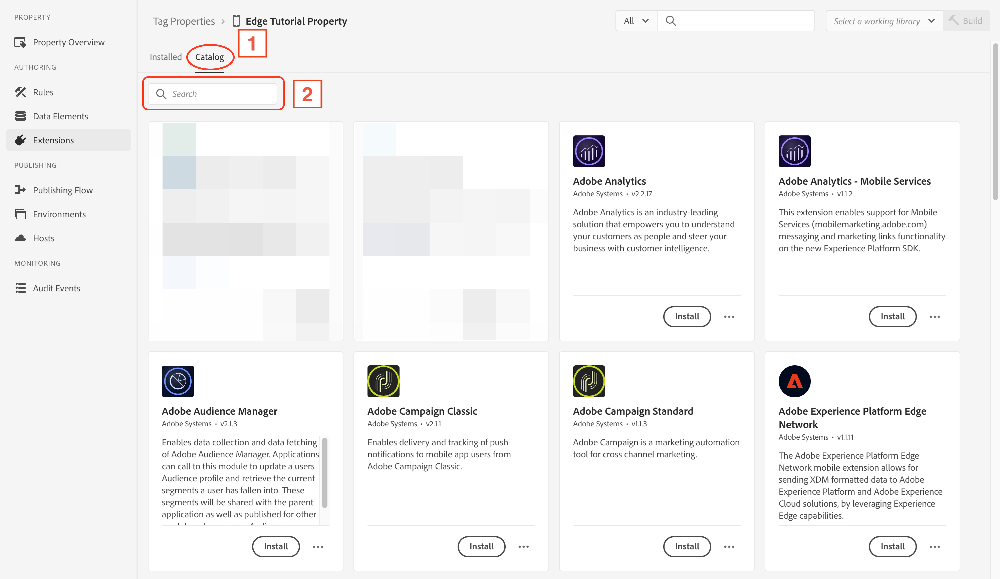  

Install the AEP extensions with the following configurations:

<details>
  <summary> AEP Assurance </summary><p>

Open the **Catalog** and install the `AEP Assurance` extension configuration.

  

</p></details>

<details>
  <summary> Adobe Experience Platform Edge Network </summary><p>

Open the **Catalog** and install the `Adobe Experience Platform Edge Network` extension configuration.

  

In the extension configuration settings window, set the datastream for each environment (**1**) to the one created for this tutorial. Then select `Save` (**2**)

  

</p></details>

<details>
  <summary> Identity </summary><p>

Open the **Catalog** and install the **Identity** extension configuration. There are no settings for this extension.

  

</p></details>

<details>
  <summary> Consent </summary><p>

Open the **Catalog** and install the **Consent** extension configuration.

  

In the extension configuration settings window, the **Default Consent Level** should be set to **Yes** by default (**1**); for the tutorial app this setting is fine as-is, however when using this configuration in production apps, it should reflect the requirements of the company's actual data collection policy for the app. 

  

</p></details>

You should see the following after all the extensions are installed: 

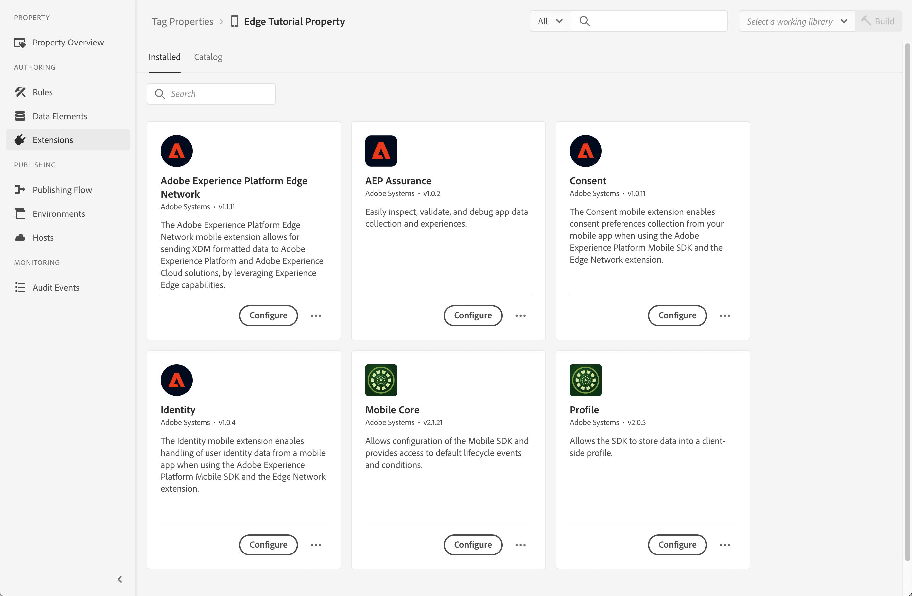  

### 4. Configure a Rule to forward Lifecycle metrics to Edge Network 

The Lifecycle for Edge extension sends app foreground and background events, and a rule needs to be configured in order to forward these events to the Edge Network. Note that there is no need to install Lifecycle since it is already included with Mobile Core.

#### Create a rule<!-- omit in toc -->
1. On the Rules tab, select **Create New Rule**.
   - If your property already has rules, the button will be in the top right of the screen.

  

2. Give your rule an easily recognizable name (**1**) in your list of rules. In this example, the rule is named "Forward Lifecycle XDM events to Edge Network".
3. Under the **EVENTS** section, select **Add** (**2**).

  

#### Select an event<!-- omit in toc -->

2. From the **Extension** dropdown list (**1**), select **Mobile Core**.
3. From the **Event Type** dropdown list (**2**), select **Foreground**.
4. Select **Keep Changes** (**3**).

  

5. Under the **EVENTS** section again, select the plus icon (**1**) to add another Event.

  

6. From the **Extension** dropdown list (**1**), select **Mobile Core**.
7. From the **Event Type** dropdown list (**2**), select **Background**.
8. Select **Keep Changes** (**3**).

  

#### Define the action<!-- omit in toc -->
1. Under the Actions section, select **+ Add** (**1**).

  

2. From the **Extension** dropdown list (**1**), select **Adobe Experience Platform Edge Network**.
3. From the **Action Type** dropdown list (**2**), select **Forward event to Edge Network**.
4. Select **Keep Changes** (**3**).

  

#### Save the rule and rebuild your property<!-- omit in toc -->
1. After you complete your configuration, verify that your rule looks like the following:
2. Select **Save** (**1**).

  

### 5. Publish changes
1. Select **Publishing Flow** under **PUBLISHING** in the left-side navigation window.
2. Select **Add Library** in the top right.
3. Set a **Name** (**1**) for the property, and set the environment to **Development** (**2**)
4. Select **Add All Changed Resources** (**3**)
5. Select **Save & Build to Development** (**4**)

  

#### Getting the mobile property ID<!-- omit in toc -->
Once the mobile property is published to the **Development** environment:  
1. Select the box icon next to the environment dropdown (**5**, from above)
2. Select the double overlapping box (**1**) to the right of the property ID to copy it. Save this unique ID (in a text file, or other easily accessible place), as it is required when setting up the app in the next section.

  

## Client-side implementation

Now that the server side configuration is complete, install the extensions in the app and enable extension functionality by making some code updates.

### 1. Get a copy of the tutorial app code files
1. Open the code repository: https://github.com/adobe/aepsdk-edge-ios
2. Select **Code** in the top right 
3. In the window that opens, select **Download ZIP**; by default it should land in your **Downloads** folder.
   - Optionally, move the ZIP to your **Documents** folder
4. Unzip the archived file by double selecting it, and keep this Finder window open, as it will be used later.

### Initial project environment setup<!-- omit in toc -->
Next, we need to set up the project environment using the following steps:

1. Open the Terminal app.
   - Using Finder, open **Applications** -> **Utilities** -> **Terminal**
   - Alternatively, open Spotlight search (keyboard shortcut: CMD + Space) and search for "terminal", then select the **Terminal** app to open it.
2. Type the following characters, but do not press return yet: `c` + `d` + `SPACE`  
You should see the following in your terminal: "cd " (the space after `cd` is important!).
```bash
cd 
```
3. Return to your Finder window that has the unzipped repository folder. Open the folders: **Documentation** -> **Tutorials** (**1**). Inside **Tutorials** there should be an **EdgeTutorialAppStart** folder. Select and drag the **EdgeTutorialAppStart** folder (**2**) into your Terminal window that has the `cd ` command typed. You should see something like: `cd /Users/tim/Documents/aepsdk-edge-ios/Documentation/Tutorials/EdgeTutorialAppStart`  

  

4. Then press `return` to execute the command.

<details>
  <summary> What is <code>cd</code> and what does it do? </summary><p>

`cd` is the terminal command for change directory; the command above changes the terminal's active directory context to the tutorial folder that holds the tutorial app's code.

The long string after is the full path (kind of like an address) to the code repository folder: `/Users/tim/Documents/aepsdk-edge-ios/Documentation/Tutorials/EdgeTutorialAppStart`, taken together, this command changes our terminal window context to the tutorial app code folder.

</p></details>

<details>
  <summary> Using Swift package manager instead? </summary><p>

**Swift Package Manager**
This tutorial assumes a project using Cocoapods for package dependency management, but if following along with a project that uses Swift package manager, refer to the [README for instructions on how to add the package](../../README.md#swift-package-manager).  

</p></details>

### 2. Install the Edge extensions using CocoaPods (dependency manager)
Using the same terminal context, enter the following command:

```bash
pod install
```

<details>
  <summary> Expected output </summary><p>

```
tim@Tims-MacBook-Pro aepsdk-edge-ios % pod install
Analyzing dependencies
Downloading dependencies
Generating Pods project
Integrating client project
Pod installation complete! There are 0 dependencies from the Podfile and 0 total pods installed.

[!] The Podfile does not contain any dependencies.

...

tim@Tims-MacBook-Pro aepsdk-edge-ios % 
```

</p></details>

The terminal should output something similar to the expected output above; if so, you're good to go! However, if you get an error like: "zsh: command not found: pod", then you need to [install Cocoapods](https://guides.cocoapods.org/using/getting-started.html), then open a new terminal window and follow the instructions from [initial project environment setup](#initial-project-environment-setup). 

Next, install the Edge extensions for the tutorial app. This can easily be done by updating the file that controls the package dependencies for the repository. 

1. Open the project using the command:
```bash
open EdgeTutorialApp.xcworkspace
```

This should automatically open the Xcode IDE. In Xcode:
1. Select the dropdown chevron (**1**) next to `Pods` in the left-side navigation panel.
2. Select the `Podfile` file (**2**).   
   
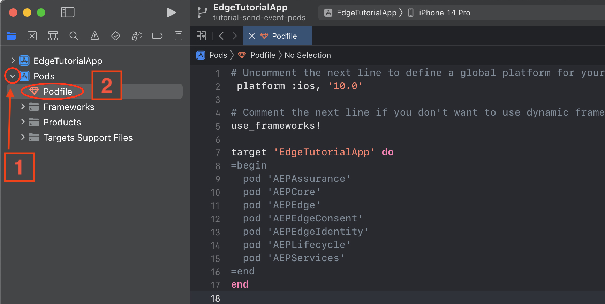  

You should see a section like the following: 

```ruby
target 'EdgeTutorialApp' do
=begin
  pod 'AEPAssurance'
  pod 'AEPCore'
  pod 'AEPEdge'
  pod 'AEPEdgeConsent'
  pod 'AEPEdgeIdentity'
  pod 'AEPLifecycle'
  pod 'AEPServices'
=end
end
```
Add a pound symbol `#` in front of the `=begin` and `=end` like so:

```ruby
target 'EdgeTutorialApp' do
#=begin
  pod 'AEPAssurance'
  pod 'AEPCore'
  pod 'AEPEdge'
  pod 'AEPEdgeConsent'
  pod 'AEPEdgeIdentity'
  pod 'AEPLifecycle'
  pod 'AEPServices'
#=end
end
```

1. Go back to your terminal window and run:
```bash
pod update
```

Cocoapods will use the newly updated configuration file to install the new packages (all of the new Edge extensions), which will allow us to use the Edge extensions' features in the app's code. 

<details>
  <summary> Expected output </summary><p>

```
tim@Tims-MacBook-Pro aepsdk-edge-ios % pod update
Update all pods
Updating local specs repositories
Analyzing dependencies
Downloading dependencies
Installing AEPAssurance (3.0.1)
Installing AEPCore (3.7.1)
Installing AEPEdge (1.4.1)
Installing AEPEdgeConsent (1.0.1)
Installing AEPEdgeIdentity (1.1.0)
Installing AEPLifecycle (3.7.1)
Installing AEPRulesEngine (1.2.0)
Installing AEPServices (3.7.1)
Generating Pods project
Integrating client project
Pod installation complete! There are 7 dependencies from the Podfile and 8 total pods installed.
tim@Tims-MacBook-Pro aepsdk-edge-ios % 
```

</p></details>

### 3. Update tutorial app code to enable Edge features
There are three files to update to enable the Edge extensions' features. Thankfully, all of the code changes are contained in block comments like the Podfile so only a few changes have to be made!

1. Select the dropdown chevron next to `EdgeTutorialApp` in the left-side navigation panel to open the project.
2. Select the dropdown chevron next to `EdgeTutorialApp` to open the directory holding the code files.
3. Select the `AppDelegate.swift` file.
4. First update the `ENVIRONMENT_FILE_ID` value to the mobile property ID published in the first section.
   - See how to get your mobile property ID in the instructions for [getting the mobile property ID](#getting-the-mobile-property-id).

Inside this file, you will see code blocks for this tutorial that are greyed out, because they are block commented out. They are marked by the header and footer:  
`Edge Tutorial - code section (n/m)`  
Where `n` is the current section and `m` is the total number of sections in the file.

To activate the code, simply add a forward slash `/` at the front of the header:
```swift
/* Edge Tutorial - code section (1/2)
```
To:
```swift
//* Edge Tutorial - code section (1/2)
```
Make sure to uncomment all sections within each file (the total will tell you how many sections there are):
1. `AppDelegate.swift`
2. `SceneDelegate.swift`
3. `ContentView.swift`

### Edge extension details<!-- omit in toc -->
For details on the various Edge extensions used, see the [table of related projects](../../README.md#related-projects).

Notice that the Lifecycle APIs rely on the developer to place them in the proper iOS app lifecycle functions (as seen in `SceneDelegate.swift`); that is, iOS has built-in functions that are called by the operating system that give the app notices that it is about to enter an active state, or go into a background state, etc. A proper Lifecycle extension implementation requires that the developer places the API calls in the required iOS lifecycle functions. See the full guide on [implementing Lifecycle](https://developer.adobe.com/client-sdks/documentation/mobile-core/lifecycle/).

### 4. Run app
In Xcode: 
1. Set the app target (**1**) to **EdgeTutorialApp** (if not already).
2. Choose which destination device (**2**) to run it on (either iPhone simulator or physical device). 
3. Select the play button (**3**).

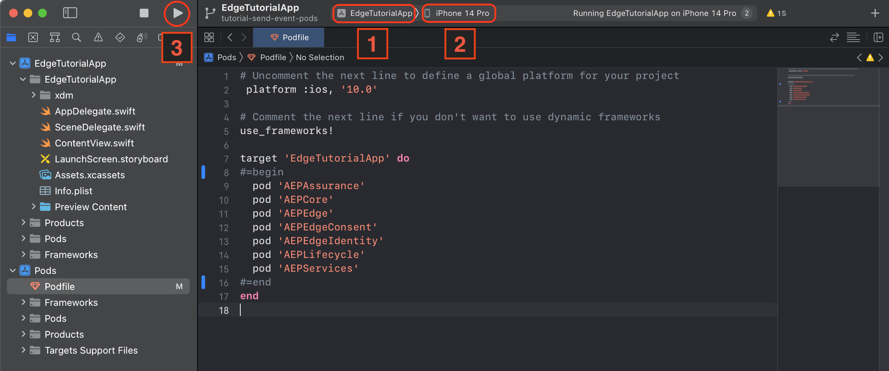

You should see the application running on the device you selected, with logs being displayed in the debug console in Xcode. 

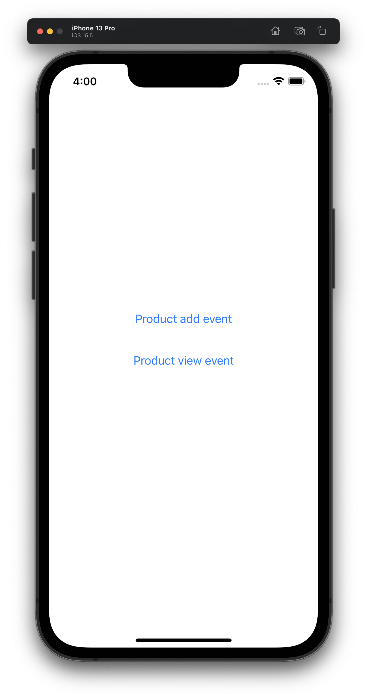

> **Note**
> If the debug console area is not shown by default, activate it by selecting:  
> View -> Debug Area -> Show Debug Area

### 5. `sendEvent` implementation examples
With Edge extension successfully installed and registered, you can make `sendEvent` calls, which will be processed by the Edge extension and sent to the Edge network.

Check `ContentView.swift` for implementation examples of product add and view events. You can see the data payloads that are to be sent with the calls. Notice that they conform to the Commerce XDM schema structure set up in the first section.

The first button shows an example of using an XDM object that adheres to the `XDMSchema` protocol provided by the Edge extension; basically, this is a way to construct the event data using a structured blueprint with value checks and other handy developer features. It gives developers a more robust framework to interact with the data values.

The second button shows an example of using a data dictionary to construct the event data. This method provides more flexibility, but can potentially be more error prone. 

## Validation with Assurance
With the server side configuration and app setup complete, Assurance makes it possible to take a look at the event flow in real time and inspect the details of individual events; using Assurance, the Experience Events sent out by the Edge extension can be validated to have the required format.

### 1. Set up the Assurance session
1. In the browser, navigate to [Assurance](https://experience.adobe.com/assurance) and login using your Adobe ID credentials.
2. Select **Create Session** in the top right.


3. In the **Create New Session** dialog, select **Start** (**1**)
 
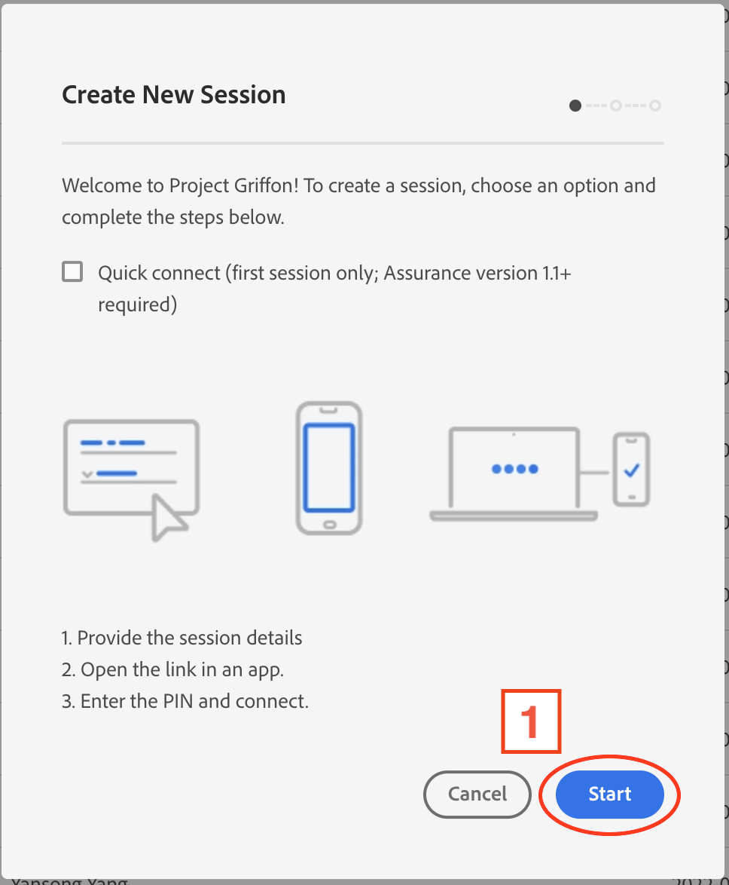

4. Enter a name (**1**) to identify the session (can be any desired name) 
5. Use Base URL value (**2**): 
```
edgetutorialapp://
```   
6. Select **Next** (**3**)  


<details>
  <summary> What is a base URL? </summary><p>

The Base URL is the ID used launch your app via deep linking. An Assurance session URL is generated by combining this app ID with the Assurance session's own unique ID. For example in the session URL:  
`myapp://?adb_validation_sessionid=a3a1b9d5-0b1e-40bf-a732-954ed1d6491f`  
In its component parts:  
1. `myapp://` is the ID required by the device's operating system to open the correct app  
2. `?adb_validation_sessionid=a3a1b9d5-0b1e-40bf-a732-954ed1d6491f` is the unique session ID Assurance uses to initiate the connection to your session.

In total, to connect an app to Assurance you need:  
On the app side:
1. The app URL to be set to a unique value
2. Code to accept opening the app via deep linking, and what to do with the incoming Assurance session ID (in our case, using it to initiate a connection with our Assurance session; examples of this can be found in the tutorial app)

On the Assurance session side:
1. The base URL to be set to the same value as the app URL (Assurance handles the rest of the connection link setup)

> **Note**  
> In Xcode the app URL can be configured using these steps:
> 1. Select the project in the navigator.
> 2. Select the app target in the `Targets` section, in the project configuration window.
> 3. Select the `Info` tab.
> 4. Set the desired deep linking URL.
>   
> Please note that there is still code on the application side that is required for the app to respond to deep links; see the [guide on adding Assurance to your app](https://developer.adobe.com/client-sdks/documentation/platform-assurance-sdk/#add-the-aep-assurance-extension-to-your-app). For general implementation recommendations and best practices, see Apple's guide on [Defining a custom URL scheme for your app](https://developer.apple.com/documentation/xcode/defining-a-custom-url-scheme-for-your-app)

</p></details>


When presented with this window, your new Assurance session is ready to go, and it is now possible to connect the app to the session.  
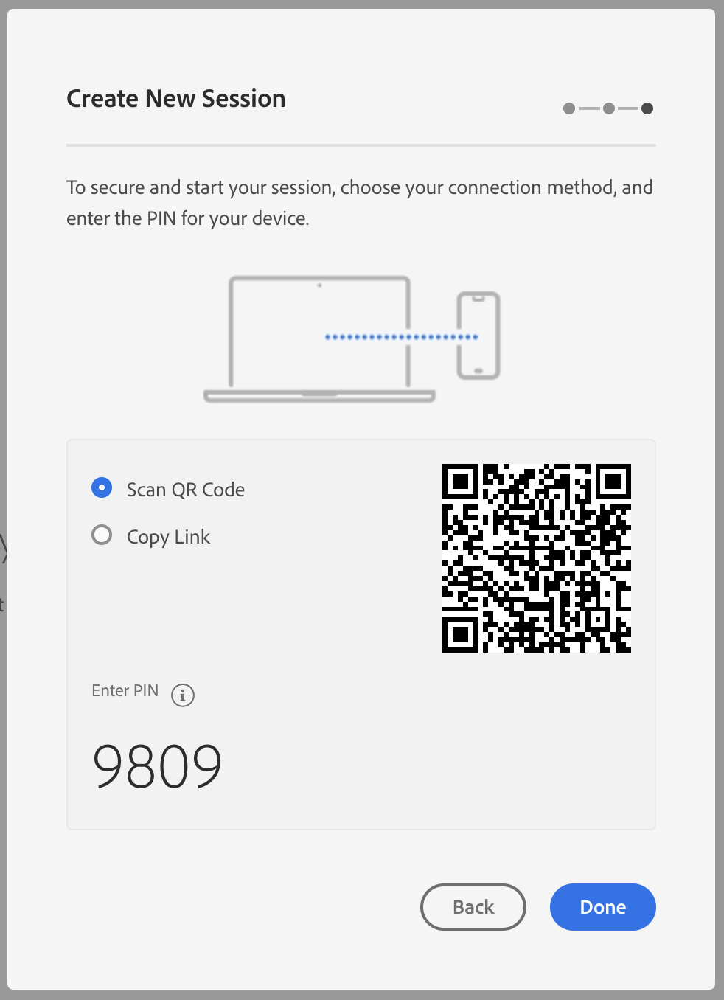


### 2. Connect to the app
To connect to Assurance, use the session link:
1. Copy the session link; you can select the icon of a double overlapping box to the right of the link to copy it.
    - If using a physical device, it may be helpful to have a way to send this link to the device (ex: Airdrop, email, text, etc.). Alternatively, you can use the camera on your physical device to scan the QR code.
2. Open Safari (or other web browser) on the iOS Simulator (or actual device, depending on which target device was selected to run the tutorial app).
3. Paste the Assurance session link copied from step 1 into the URL/search text field and enter, or use **Paste and Go**.
    - If using the simulator, it is possible to enable the paste menu by clicking in the text field twice, with a slight pause between clicks.
4. A new dialog box should open requesting to open the tutorial app, select **OK**.


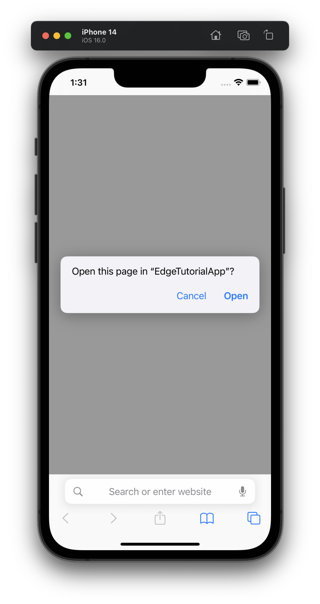  

5. App should open and show the Assurance PIN screen to authenticate the session connection; enter the PIN from the session details and tap **Connect** (**1**).


<details>
  <summary> Help! I got an error, what do I do? </summary><p>

When using the link, if you see the error: "Safari cannot open the page because the address is invalid"

  

1. Make sure that the base URL for the Assurance session is set to the correct value (`edgetutorialapp://`), and try recopying the link and submitting again.
   - For instructions on how to change the base URL value, see the section **Details on connecting to Assurance** under [Connect to the app](#2-connect-to-the-app)
2. Make sure that the tutorial app is installed on the device. If it was already installed, try uninstalling it and reinstalling it.

If in the app, after entering the PIN code and tapping **Connect**, you see the error: "Invalid Mobile SDK Configuration The Experience Cloud organization identifier is unavailable. Ensure SDK configuration is setup correctly. See documentation for more detail."

1. Make sure that the mobile property used has Assurance installed, and that the property has been properly published.
2. Make sure that the mobile property ID is set in the `ENVIRONMENT_FILE_ID` variable in `AppDelegate.swift`, then rebuild the app.

</p></details>

Once connected to Assurance, in the tutorial app, an Adobe Experience Platform icon (**1**) will appear in the top right corner of the screen with a green dot indicating a connected session.  
  

In the web-based Assurance session, there is also an indicator in the top right that shows the number of connected sessions (which in this case should now show a green dot with "1 Client Connected" (**1**)).  
  

Notice how in the Assurance session Events view (**2**), there are already events populating as a consequence of the connection of the mobile app to the Assurance session (**3**); the Assurance extension itself emits events about the session connection and subsequently captures these events to display in the web-based session viewer. You can expect Assurance to capture all events processed by the AEP SDK from all other extensions as well.  

### 3. Inspect events with Assurance
#### Send product related Experience events<!-- omit in toc -->
In order to see Edge events, in the connected app instance:
1. Select either **Product add event** or **Product view event** to send an Experience Event to the Edge Network! 
   - Behind the scenes the buttons use the `sendEvent` API from the Edge extension. This event will be captured by the Assurance extension and shown in the web session viewer.

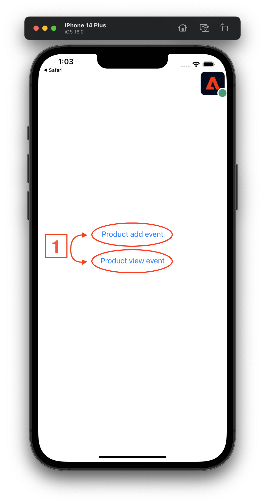

#### Inspect events using Events view<!-- omit in toc -->
1. Select the `AEP Request Event` event (**1**) in the events table to see the event details in the right side window.
2. Select the **RAW EVENT** dropdown (**2**) in the event details window to see the event data payload. 
3. Verify that the `ACPExtensionEventData` matches what was sent by the Edge `sendEvent` API.

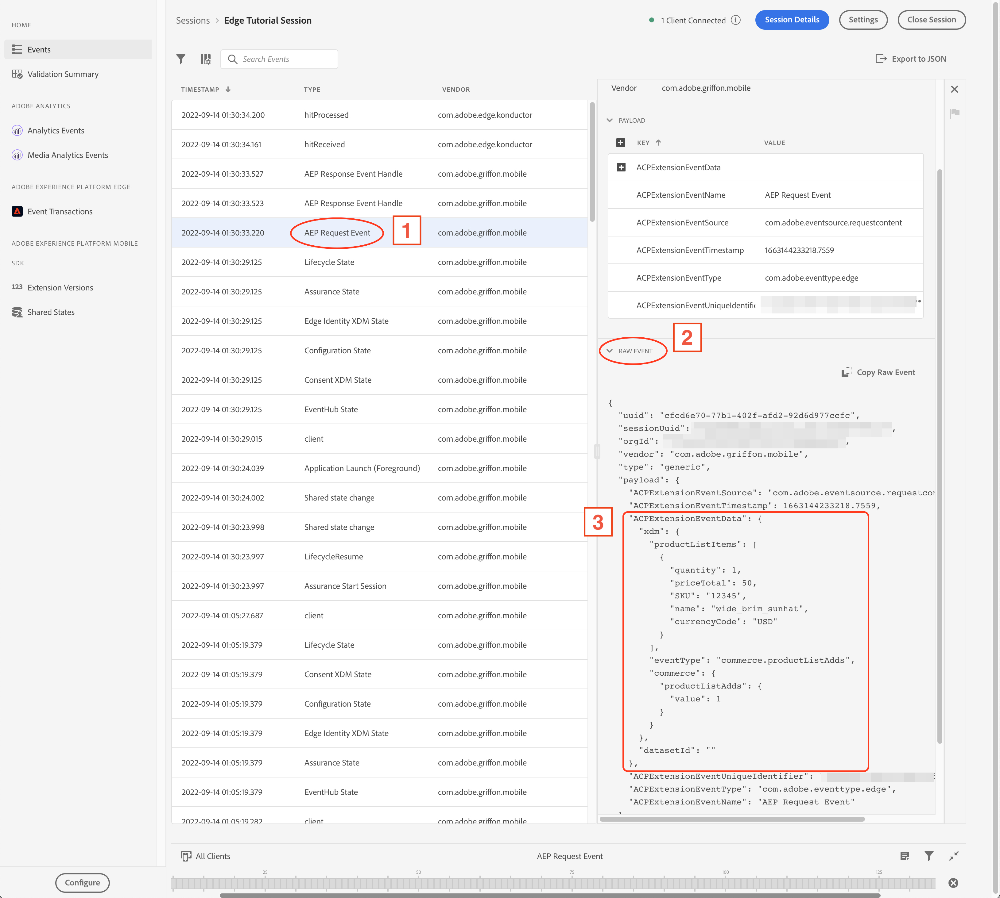

> **Note**
> The two top level properties `xdm` and `data` are standard Edge event properties that are part of the Edge platform's XDM schema-based system for event data organization that enables powerful, customizable data processing. 

Our previous efforts to configure the Adobe Experience Platform settings to route Edge events to Analytics pays off in the next event to check, the `analytics.mapping` event:


#### Inspect events using Event Transactions view<!-- omit in toc -->
Assurance also provides another view that shows a visual flow of events, which may be helpful in understanding the relationship between events.
1. Select **Event Transactions** (**1**) under the section label **Adobe Experience Platform Edge** in the left-side navigation panel.

In this view, each of the cards represents a step in the workflow of events. You can select on the underlined items in each card to see more details about each event in the right-side details panel.

For example, using our recent Experience Event sent from the tutorial app, the flow of events is visible:
1. The client side (that is, the app) event that was sent to the Edge Network.
2. The Edge Network receiveing the event, and using the datastream settings (XDM schema paired with Analytics service) to know where how to interpret the event data, and where to send it.
3. Analytics is able to convert our XDM formatted data into the corresponding Analytics format automatically!
   - This is one of the key benefits of using Adobe created XDM schemas (and the XDM schema system in general); the various Adobe services that act on data formatted using these schemas are able to easily understand and make use of it.

